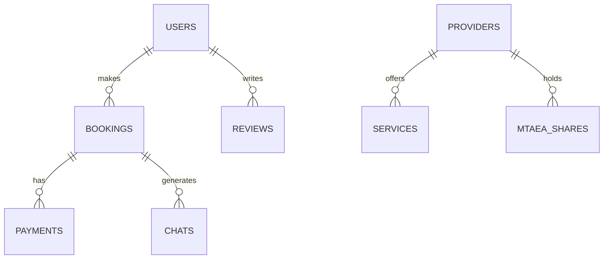

# 🏗️ Hequeendo Platform - Comprehensive Project Plan

## 📋 Table of Contents
1. [Project Overview](#-project-overview)
2. [Strategic Vision](#-strategic-vision)
3. [Project Phases & Timeline](#-project-phases--timeline)
4. [Technical Architecture](#-technical-architecture)
5. [Team Structure](#-team-structure)
6. [Resource Requirements](#-resource-requirements)
7. [Risk Management](#-risk-management)
8. [Quality Assurance](#-quality-assurance)
9. [Deployment Strategy](#-deployment-strategy)
10. [Success Metrics](#-success-metrics)
11. [Post-Launch Support](#-post-launch-support)
12. [Appendices](#-appendices)

## 🌟 Project Overview

Hequeendo is a revolutionary service marketplace platform that transforms how customers discover and book local services while empowering service providers with business tools and ownership opportunities through the Mtaa Shares program.

## 🎯 Strategic Vision

### Core Objectives
1. **Digital Transformation**: Digitize the informal service economy in Africa
2. **Economic Empowerment**: Create sustainable income opportunities for service providers
3. **Trust & Safety**: Build a verified, community-driven trust system
4. **Financial Inclusion**: Provide access to financial services for the unbanked
5. **Data Intelligence**: Leverage data to improve service delivery and user experience

### Long-term Goals
- Expand to 10+ African countries within 5 years
- Onboard 1M+ service providers
- Process $100M+ in annual transactions
- Create 500K+ direct jobs
- Establish the largest network of trusted service providers in Africa

## 🗓️ Project Phases & Timeline

### Phase 1: Foundation (Weeks 1-4)
**Objective**: Establish core infrastructure and basic functionality
- [x] Project setup & repository structure
- [x] Core database schema design
- [x] Authentication & authorization system
- [x] Basic API endpoints
- [x] Development environment setup
- [x] CI/CD pipeline configuration

### Phase 2: Core Platform (Weeks 5-10)
**Objective**: Build essential platform features
- [ ] User management system
  - Role-based access control
  - Profile management
  - KYC verification
- [ ] Service management
  - Service categories & subcategories
  - Provider service profiles
  - Pricing models
- [ ] Booking system
  - Real-time availability
  - Scheduling engine
  - Booking management

### Phase 3: Mobile Experience (Weeks 11-16)
**Objective**: Deliver seamless mobile experience
- [ ] Customer mobile app
  - Service discovery
  - Booking flow
  - In-app chat
  - Payment integration
- [ ] Provider mobile app
  - Job management
  - Schedule view
  - Earnings dashboard
  - Customer communication

### Phase 4: Web Dashboards (Weeks 17-20)
**Objective**: Create powerful web interfaces
- [ ] Provider web portal
  - Business analytics
  - Service management
  - Financial reporting
- [ ] Admin dashboard
  - User management
  - Content moderation
  - System configuration
  - Analytics & reporting

### Phase 5: Advanced Features (Weeks 21-26)
**Objective**: Implement value-added features
- [ ] Mtaa Shares program
  - Equity distribution model
  - Blockchain integration
  - Rewards system
- [ ] AI/ML capabilities
  - Smart matching
  - Dynamic pricing
  - Fraud detection
- [ ] Community features
  - Neighborhood networks
  - Group bookings
  - Social proof

### Phase 6: Testing & Optimization (Weeks 27-30)
**Objective**: Ensure quality and performance
- [ ] Comprehensive testing
  - Unit tests
  - Integration tests
  - Load testing
  - Security audit
- [ ] Performance optimization
  - Database optimization
  - Frontend performance
  - API response times
- [ ] User acceptance testing
  - Beta program
  - Feedback collection
  - Bug fixes

### Phase 7: Launch Preparation (Weeks 31-32)
**Objective**: Prepare for successful launch
- [ ] Marketing materials
- [ ] User documentation
- [ ] Support systems
- [ ] Launch checklist
- [ ] Team training

## 🏗️ Technical Architecture

### System Architecture
```
┌───────────────────────────────────────────────────────────────┐
│                        Client Applications                    │
├─────────────────┬───────────────────────┬─────────────────────┤
│ Mobile (iOS/Android) │   Web Portal     │   Admin Dashboard   │
└────────┬────────┴───────────┬───────────┴─────────┬───────────┘
         │                    │                     │
         ▼                    ▼                     ▼
┌───────────────────────────────────────────────────────────────┐
│                      API Gateway Layer                        │
├───────────────────────────────────────────────────────────────┤
│                  Microservices Architecture                   │
├───────────────┬───────────────┬────────────────┬──────────────┤
│  User Service │ Booking Svc   │ Payment Svc    │  Mtaa Svc   │
├───────────────┼───────────────┼────────────────┼──────────────┤
│  Notification │  Search Svc   │  Analytics Svc │  Chat Svc   │
└───────┬───────┴───────┬───────┴────────────────┴──────┬───────┘
        │               │                               │
        ▼               ▼                               ▼
┌───────────────────────────────────────────────────────────────┐
│                       Data Layer                              │
├─────────────────┬───────────────────────┬─────────────────────┤
│  PostgreSQL     │      Redis Cache      │    S3 Storage      │
└─────────────────┴───────────────────────┴─────────────────────┘
```

### Technology Stack

#### Frontend
- **Mobile**: React Native (Unified app)
  - State Management: Redux Toolkit
  - Navigation: React Navigation 6.x
  - Maps: Mapbox GL Native
  - UI: NativeBase + Custom Components
  - Offline Support: Redux Persist
  - Analytics: Firebase Analytics

- **Web**: Next.js 14+
  - TypeScript
  - State Management: React Query
  - UI: Tailwind CSS + ShadCN UI
  - Charts: Recharts
  - Forms: React Hook Form
  - Authentication: NextAuth.js

#### Backend
- **API Gateway**: Kong
- **Service Framework**: Laravel 10.x (PHP 8.2+)
- **API**: RESTful + GraphQL
- **Real-time**: Laravel WebSockets + Pusher
- **Search**: Meilisearch
- **Payments**: M-Pesa, Stripe, Flutterwave
- **Blockchain**: Polygon/Matic
- **Caching**: Redis 7.0+
- **Queue**: Laravel Horizon

#### Database
- **Primary**: PostgreSQL 15+ with PostGIS
- **Analytics**: TimescaleDB
- **Cache**: Redis
- **Search**: Meilisearch
- **Object Storage**: S3-compatible

#### Infrastructure
- **Containerization**: Docker + Kubernetes
- **Orchestration**: AWS EKS
- **CI/CD**: GitHub Actions + ArgoCD
- **Monitoring**: Prometheus + Grafana
- **Logging**: ELK Stack
- **Security**: Cloudflare WAF + DDoS Protection
- **CDN**: Cloudflare Enterprise

## 👥 Team Structure

### Core Team
- **Product Management**
  - 1 Product Manager
  - 1 Product Owner

- **Engineering**
  - 1 Engineering Manager
  - 3 Backend Engineers (PHP/Laravel)
  - 2 Mobile Engineers (React Native)
  - 2 Frontend Engineers (Next.js/React)
  - 1 DevOps Engineer

- **Design & UX**
  - 1 UX Lead
  - 1 UI Designer
  - 1 UX Researcher

- **Quality Assurance**
  - 2 QA Engineers (Manual & Automation)

- **Data & Analytics**
  - 1 Data Engineer
  - 1 Data Analyst

### Extended Team
- **Marketing**
  - 1 Growth Marketer
  - 1 Content Creator

- **Customer Support**
  - 1 Support Lead
  - 3 Support Agents

- **Operations**
  - 1 Operations Manager
  - 2 Community Managers

## 💼 Resource Requirements

### Development Resources
- **Hardware**
  - MacBook Pro M2 (Development)
  - Test devices (iOS & Android)
  - CI/CD Servers
  - Local development environments

### Infrastructure
- **Development**
  - Docker-based local environments
  - Shared development servers
  - Staging environment

- **Production**
  - AWS EKS Cluster
  - Managed PostgreSQL (RDS)
  - Redis Cluster
  - S3-compatible storage
  - CDN (Cloudflare)
  - Backup & Disaster Recovery

### External Services
- **Payments**
  - M-Pesa API
  - Stripe
  - Flutterwave

- **Communication**
  - Twilio (SMS/WhatsApp)
  - SendGrid (Email)
  - Pusher (WebSockets)

- **Analytics**
  - Google Analytics 4
  - Mixpanel
  - Hotjar

- **Maps & Location**
  - Mapbox
  - Google Maps API (fallback)

- **Security**
  - Cloudflare WAF
  - SSL Certificates
  - Security Audit Tools

### Budget Allocation (Annual)
- **Personnel**: $1,200,000
- **Infrastructure**: $120,000
- **Third-party Services**: $80,000
- **Marketing**: $200,000
- **Contingency**: $100,000
- **Total**: $1,700,000

## ⚠️ Risk Management

### Technical Risks & Mitigation

| Risk | Impact | Likelihood | Mitigation Strategy | Owner |
|------|---------|------------|----------------------|-------|
| API Performance Issues | High | Medium | Implement rate limiting, caching, and auto-scaling | Backend Lead |
| Data Security Breach | Critical | Low | Regular security audits, encryption at rest/transit, access controls | CTO |
| Third-party Service Outages | High | Medium | Implement circuit breakers, fallback mechanisms | DevOps Lead |
| Mobile App Crashes | High | Medium | Crash reporting, beta testing, staged rollouts | Mobile Lead |
| Payment Processing Failures | Critical | Medium | Multiple payment providers, manual override capability | Payments Lead |

### Business Risks & Mitigation

| Risk | Impact | Likelihood | Mitigation Strategy | Owner |
|------|---------|------------|----------------------|-------|
| Low Provider Adoption | High | Medium | Incentive programs, referral bonuses, onboarding support | Growth Lead |
| Regulatory Changes | High | High | Legal counsel, flexible architecture, compliance monitoring | COO |
| Payment Disputes | Medium | High | Clear T&Cs, dispute resolution process, fraud detection | Operations Lead |
| Negative User Experience | High | Medium | UX research, beta testing, feedback loops | Product Lead |
| Competition | Medium | High | Continuous innovation, focus on trust, community building | CEO |

## 🧪 Quality Assurance

### Testing Strategy

#### 1. Unit Testing
- **Coverage Goal**: 80%+ code coverage
- **Frameworks**: PHPUnit (Backend), Jest (Frontend), Detox (Mobile E2E)
- **CI Integration**: Required for all pull requests

#### 2. Integration Testing
- API contract testing
- Service-to-service communication
- Third-party service mocking

#### 3. End-to-End Testing
- Critical user journeys
- Cross-browser/device testing
- Performance benchmarking

#### 4. Security Testing
- OWASP Top 10 vulnerabilities
- Penetration testing (quarterly)
- Dependency vulnerability scanning

### Performance Benchmarks

| Metric | Target | Measurement |
|--------|---------|-------------|
| API Response Time | < 200ms | 95th percentile |
| Mobile App Launch | < 1.5s | Cold start |
| Search Results | < 800ms | 99th percentile |
| Real-time Updates | < 100ms | End-to-end |
| Concurrent Users | 10,000+ | Without degradation |

### Security Standards

#### Data Protection
- End-to-end encryption for sensitive data
- Regular security audits and penetration tests
- Compliance with GDPR, CCPA, and local regulations

#### Authentication & Authorization
- OAuth 2.0 / OpenID Connect
- Multi-factor authentication (MFA)
- Role-based access control (RBAC)

#### Monitoring & Incident Response
- 24/7 security monitoring
- Incident response plan
- Regular security training for staff

## 🚀 Deployment Strategy

### Environment Strategy

| Environment | Purpose | Access | Data |
|-------------|---------|--------|------|
| **Development** | Feature development | Developers | Mock/Sample Data |
| **Staging** | Pre-production testing | Internal Team | Anonymized Production Data |
| **UAT** | User acceptance testing | Beta Testers | Production-like Data |
| **Production** | Live environment | All Users | Real Production Data |

### Deployment Pipeline

1. **Code Review & Merge**
   - Pull request workflow
   - Automated checks (linting, tests, security scans)
   - Peer code review required

2. **Automated Testing**
   - Unit tests (required)
   - Integration tests (required)
   - E2E tests (required for critical paths)
   - Performance benchmarks

3. **Staging Deployment**
   - Automated deployment to staging
   - Smoke tests
   - QA verification

4. **Production Deployment**
   - Blue/Green deployment strategy
   - Canary releases (5% traffic initially)
   - Feature flags for gradual rollout
   - Automated rollback on failure

### Monitoring & Observability

#### Infrastructure Monitoring
- **Tools**: Prometheus, Grafana, CloudWatch
- **Metrics**: CPU, Memory, Disk, Network
- **Alerts**: Automated alerts for anomalies

#### Application Performance
- **APM**: New Relic / Datadog
- **Logging**: Centralized ELK Stack
- **Tracing**: Distributed tracing with Jaeger
- **RUM**: Real User Monitoring

#### Business Metrics
- **Dashboard**: Custom analytics dashboard
- **KPIs**: Tracked in real-time
- **Alerts**: Business metric thresholds

### Rollback Strategy

1. **Automated Rollback**
   - Health check failures
   - Error rate spikes
   - Performance degradation

2. **Manual Rollback**
   - Business decision
   - Critical bugs found
   - Security vulnerabilities

3. **Data Recovery**
   - Point-in-time recovery
   - Database backups (hourly/daily)
   - Disaster recovery plan

## 📊 Success Metrics

### Technical KPIs
| Metric | Target | Measurement |
|--------|--------|-------------|
| System Uptime | 99.95% | Monthly |
| API Availability | 99.9% | Weekly |
| API Response Time | < 200ms | 95th percentile |
| Mobile App Crash Rate | < 0.1% | Weekly |
| Deployment Frequency | Multiple/day | Weekly |
| Change Failure Rate | < 5% | Monthly |
| MTTR (Mean Time to Recover) | < 30min | Monthly |

### Business KPIs
| Metric | Target (Y1) | Target (Y2) |
|--------|-------------|-------------|
| Monthly Active Users | 50,000 | 250,000 |
| Registered Providers | 5,000 | 25,000 |
| Monthly Transactions | 100,000 | 500,000 |
| Gross Merchandise Value | $1M | $10M |
| Customer Retention | 40% | 60% |
| Provider Retention | 60% | 80% |
| Average Rating | 4.5+ | 4.7+ |

### User Experience Metrics
| Metric | Target |
|--------|--------|
| App Store Rating | 4.5+ |
| Play Store Rating | 4.4+ |
| CSAT Score | > 90% |
| NPS Score | > 50 |
| Support Response Time | < 15min |
| Issue Resolution Time | < 4h |

## 🛠️ Post-Launch Support

### Support Structure
1. **Tier 1: Self-Service**
   - Knowledge Base
   - FAQ Section
   - Community Forums

2. **Tier 2: Chat/Email Support**
   - 24/5 Availability
   - < 15min Response Time
   - Common Issue Resolution

3. **Tier 3: Technical Support**
   - Developer Access
   - Escalated Issues
   - Bug Fixes

### Maintenance Windows
- **Regular Updates**: Weekly (off-peak hours)
- **Emergency Updates**: As needed with 1h notice
- **Scheduled Maintenance**: Bi-monthly with 72h notice

### Continuous Improvement
- **Feedback Loops**: In-app feedback, NPS surveys
- **Feature Requests**: Public roadmap
- **Bug Bounty Program**: For security researchers

### Training & Documentation
- **Users**: Video tutorials, guides
- **Providers**: Onboarding materials, webinars
- **Partners**: API documentation, integration guides
- **Internal**: Runbooks, playbooks, knowledge base

## 📚 Appendices

### A. Technical Specifications

#### API Rate Limits
| Endpoint Type | Rate Limit |
|--------------|------------|
| Public APIs | 1000 requests/minute/IP |
| Authenticated APIs | 5000 requests/minute/user |
| Admin APIs | 100 requests/minute/user |

#### Database Schema Overview


### B. Compliance Requirements

#### Data Protection
- GDPR Compliance
- CCPA Compliance
- Local Data Protection Laws
- Payment Card Industry Data Security Standard (PCI DSS)

#### Accessibility
- WCAG 2.1 AA Compliance
- Mobile Accessibility
- Screen Reader Support
- Keyboard Navigation

### C. Third-Party Services

| Service | Purpose | Integration Method |
|---------|---------|---------------------|
| Twilio | SMS/WhatsApp Notifications | REST API |
| SendGrid | Email Delivery | SMTP/API |
| Mapbox | Maps & Navigation | JavaScript SDK |
| Stripe | Payment Processing | API/Webhooks |
| M-Pesa | Mobile Payments | REST API |
| Pusher | Real-time Features | WebSockets |

## 📖 References

### Technical Documentation
1. [Laravel Documentation](https://laravel.com/docs)
2. [React Native Documentation](https://reactnative.dev/docs/getting-started)
3. [Next.js Documentation](https://nextjs.org/docs)
4. [AWS EKS Documentation](https://docs.aws.amazon.com/eks/)

### API References
1. [M-Pesa API Docs](https://developer.safaricom.co.ke/)
2. [Stripe API Reference](https://stripe.com/docs/api)
3. [Mapbox GL JS](https://docs.mapbox.com/mapbox-gl-js/api/)
4. [Pusher Channels](https://pusher.com/docs/channels)

### Security Standards
1. [OWASP Top 10](https://owasp.org/Top10/)
2. [NIST Cybersecurity Framework](https://www.nist.gov/cyberframework)
3. [GDPR Guidelines](https://gdpr-info.eu/)
4. [PCI DSS Requirements](https://www.pcisecuritystandards.org/)

### Project Management
- [GitHub Projects](https://docs.github.com/en/issues/planning-and-tracking-with-projects)
- [Jira Workflows](https://www.atlassian.com/software/jira/features/agile)
- [Notion Workspace](https://www.notion.so/)

### Performance Optimization
- [Web Vitals](https://web.dev/vitals/)
- [Lighthouse](https://developers.google.com/web/tools/lighthouse)
- [React Native Performance](https://reactnative.dev/docs/performance)

## 📅 Version History

| Version | Date | Description | Author |
|---------|------|-------------|--------|
| 1.0.0 | 2024-03-15 | Initial Project Plan | [Your Name] |
| 1.0.1 | 2024-03-16 | Updated Technical Architecture | [Your Name] |
| 1.1.0 | 2024-03-17 | Added Risk Management & QA Sections | [Your Name] |
| 1.2.0 | 2024-03-18 | Added Deployment & Support Strategy | [Your Name] |

## 🔗 Related Documents

1. [Product Requirements Document (PRD)](link-to-prd)
2. [Technical Design Document (TDD)](link-to-tdd)
3. [API Documentation](link-to-api-docs)
4. [UI/UX Design System](link-to-design-system)
5. [Security Policy](link-to-security-policy)

## 📝 Change Log

| Date | Change | Author |
|------|--------|--------|
| 2024-03-15 | Document created | [Your Name] |
| 2024-03-16 | Added architecture diagrams | [Your Name] |
| 2024-03-17 | Updated risk assessment | [Your Name] |
| 2024-03-18 | Added deployment & support strategy | [Your Name] |
| 2024-03-20 | Finalized document structure | [Your Name] |
